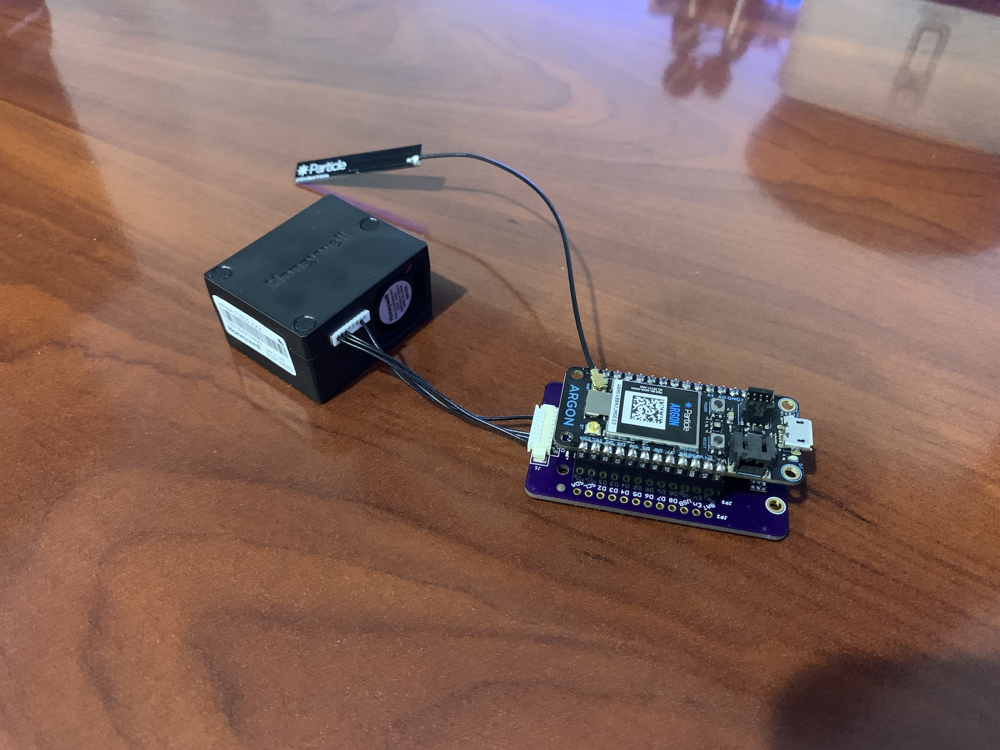
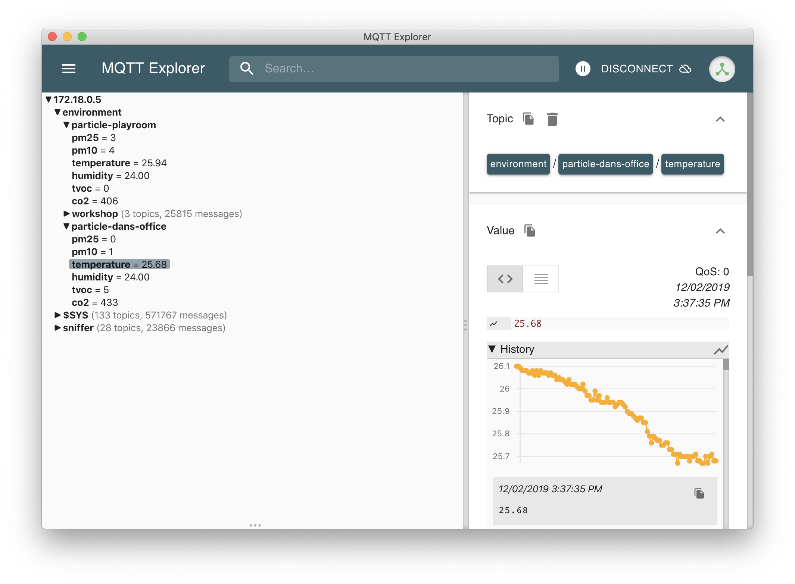
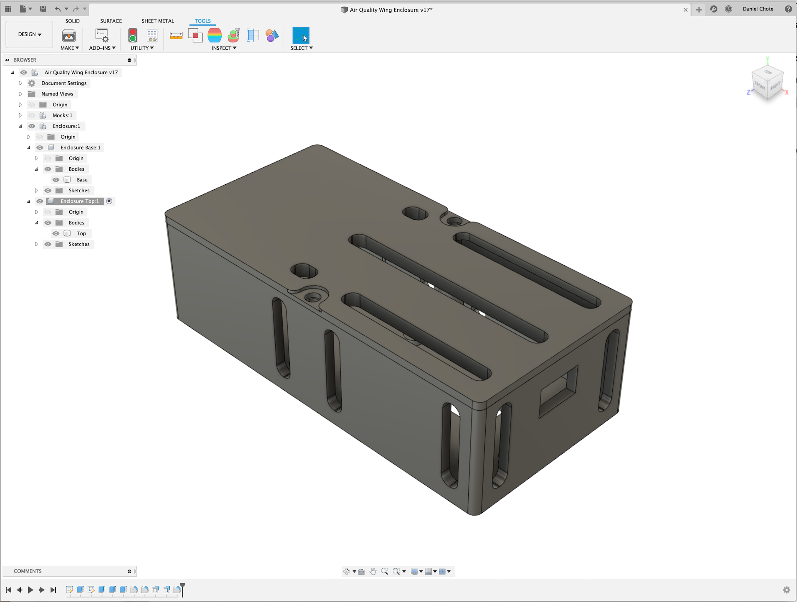

# Particle Air Quality Wing over MQTT

This a quick hack to allow writing sensor information over MQTT. It will use the Particle device name in the topic as such `environment/DEVICE_NAME/sensor`. 

## The code
Be sure to edit the `src/AirQualityWing.ino` to use the IP address of your MQTT server (eg: `char *MQTTServer = (char*)"172.18.0.5";`).  

For compilation instructions please refer to the original code by Jared Wolff here: https://github.com/jaredwolff/air-quality-wing-code

## Enclosure
I designed a simple 3d printable enclosure that can be found [here](enclosure/). 
*This enclosure doesnt have room for a battery and is expected that you power via USB.*

The holes to secure the top of the enclosure should be tapped using an M3 tap, the holes to secure the Air Quality Wing should be tapped using an M2.5 tap. 
You will need 4x M2.5 nylon screws to secure the Air Quality Wing, and 2x M3 bolts to secure the top.

More photos of the assembled unit can be found [here](images/).